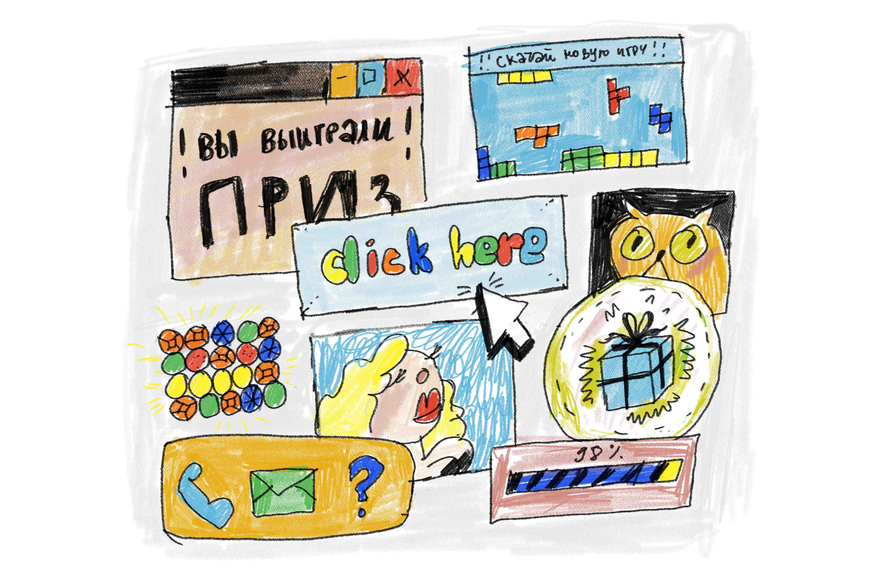
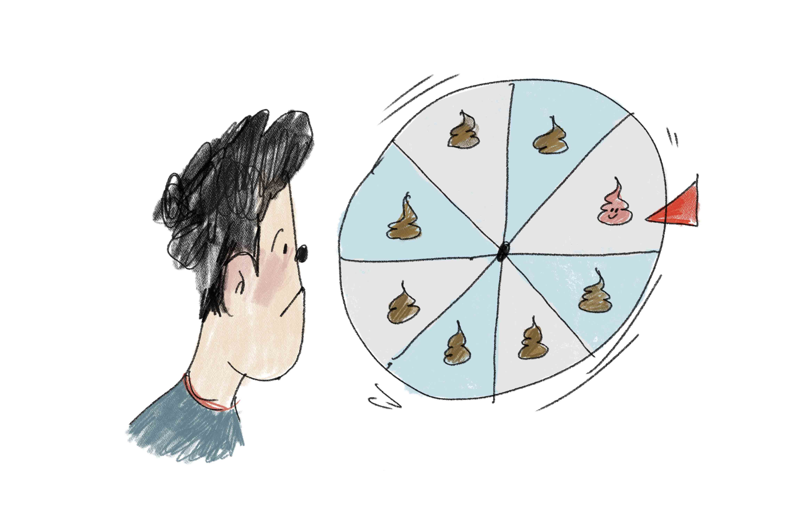
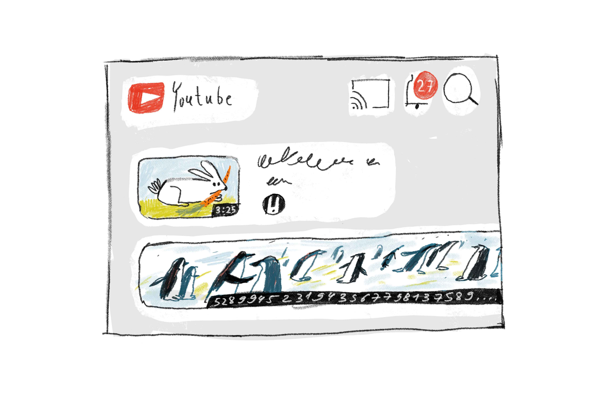
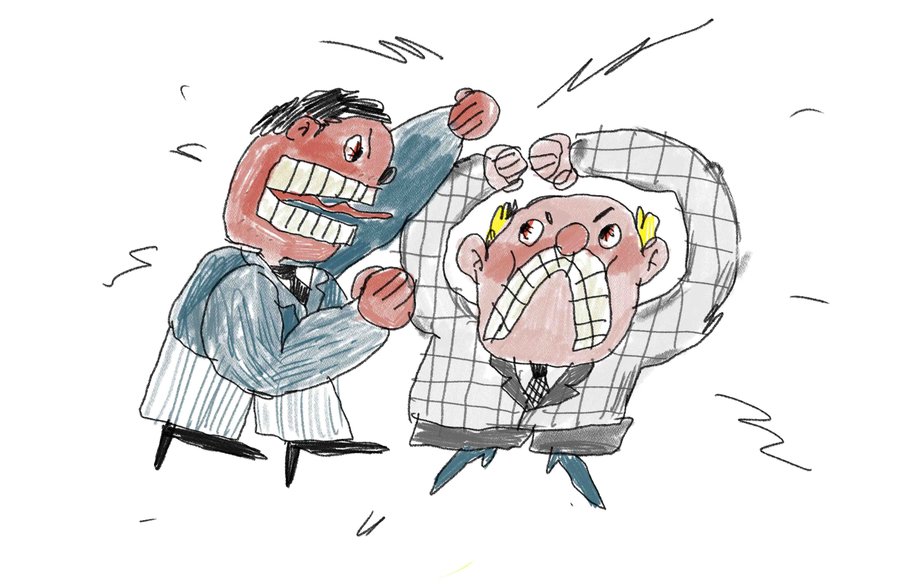
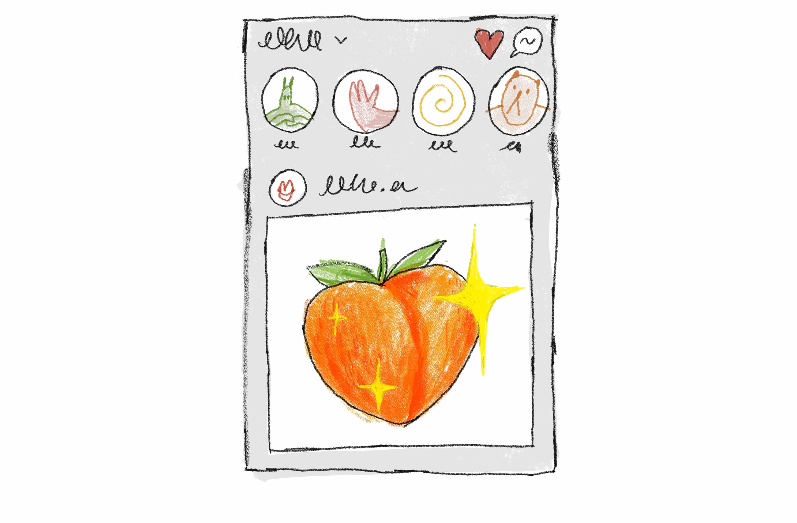
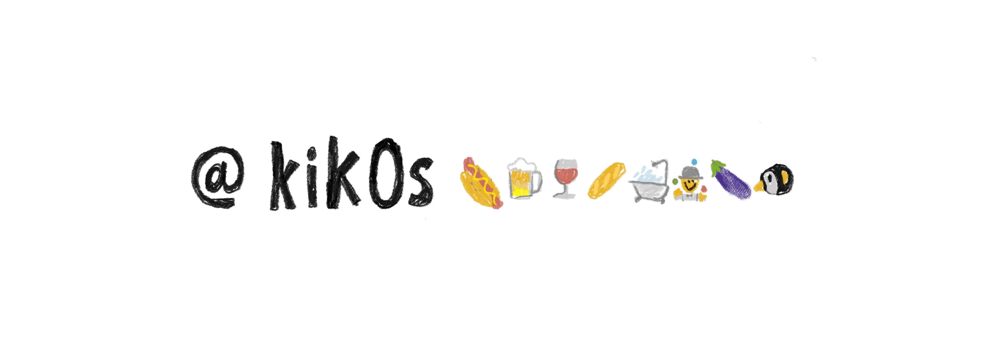
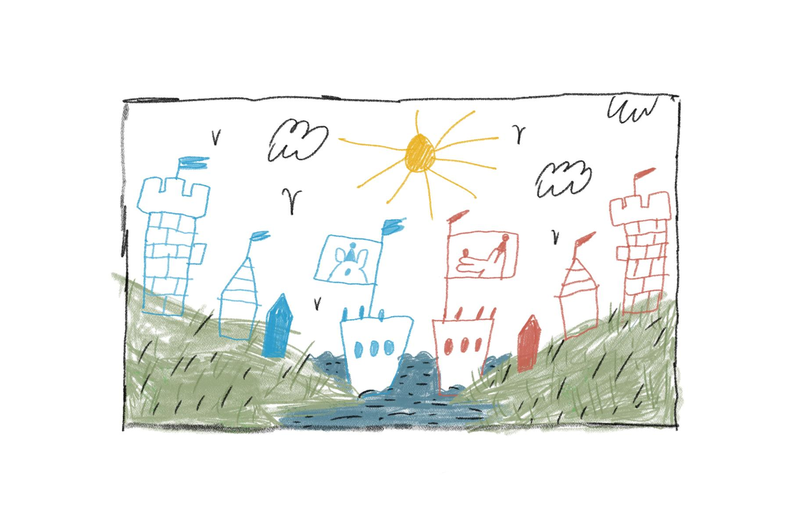
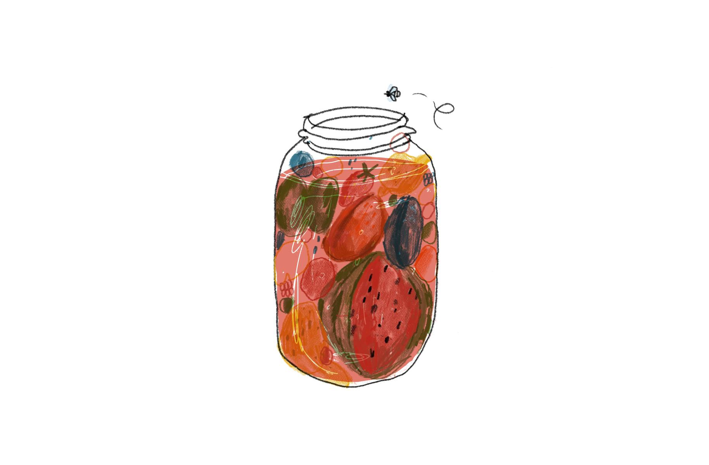

Сколько себя помню, дома стоял компьютер.

Одной из моих первых игр на нем был Microsoft word, где можно было красиво рас**кра***ши*вать слова. Через какое-то время я узнал, что в торговом центре XL, где продавали диски с мультиками, есть еще и диски с играми. Помню, что игра про <<Черепашек ниндзя>> была очень сложной, и у меня ничего в ней не получалось. Зато мне очень нравилась игра по мотивам <<Тачек>>, где был полноценный open world. Наверное, с тех пор я и полюбил open world игры.

Я хоть и был подключен к интернету, но он проходил мимо меня. Я не застал стену, которую Дуров забрал и не вернул, несмотря на многочисленные просьбы. Аккаунт ВКонтакте мне нужен был в основном для <<Зомби фермы>> и тестов <<Кто ты из Наруто>>. Да и друзей у меня в детстве особо не было, и поэтому вся эта ностальгия по контр-страйку и миссии с вертолетиком как-то прошла мимо.

Но потом как-то все завертелось: мое увлечение программированием, бум соцсетей, -- и вот десять лет спустя мое экранное время сопоставимо с временем бодрствования. Что, с одной стороны, пугает, а с другой стороны постоянно заставляет рефлексировать, как же я до такого докатился.

<!--more-->

## Бум! БУМ!

Мне кажется, было два бума. Первый -- бум гаджетов. Когда устройства стали достаточно компактными, а батарейки достаточно мощными, чтобы носить с собой. Только что у тебя была только кнопочная нокия, которая разве что змейку и плеер умела включать, а теперь бум -- дешевый доступ в интернет и экран, с которого этот интернет неплохо видно.

И это же реально было вопросом пары лет, когда на рынке сформировались основные платформы, для них появились основные соцсети, игрушки типа angry birds и fruit ninja, а сайты стали худо-бедно показывать мобильную версию.

Вот когда-то тогда случилось мое полноценное подключение. Во-первых, я стал активно подписываться на паблики с мемами. Во-вторых, у меня как раз появились друзья, так что я начал вести активные онлайн-переписки. В-третьих, я стал играть в какие-то сетевые игры на телефоне, типа Clash of Clans, где тоже есть всякие комьюнити. И это все становилось все более и более доступным.

Второй бум был алгоритмический. Человечество научилось делать так, чтобы тебе попадался контент, который ты до этого еще не видел. Некоторые платформы это делали даже до алгоритмов в нынешнем понимании этого слова, сделав хорошую систему подписок и репостов. Поэтому даже сложно сказать точно, когда именно рекомендательные системы стали строить нашу ленту. Кажется, что в конце десятых. А потом случился тикток, который сделал тихую революцию и оставил нас в новом дивном мире бесконечного контента.

И все, мы все застряли в интернете, который нам не принадлежит. Я его, конечно, люблю, но вообще-то это пиздец.

## Ну сделай целевое действие, а

За последние годы мы научились кормить машинам очень много данных. Например, сколько секунд ты смотрел видос, прежде чем просвайпать. Вне зависимости от того, лайкал ты видос или нет, приложение само догадается, показывать ли тебе такое еще, и в зависимости от этого подредактирует будущую ленту. Есть мемы про то, что алгоритмы тиктока могут определить принадлежность к ЛГБТ и продиагностировать СДВГ за первые 10 просмотренных видео. И это, кажется, недалеко от правды. 

Алгоритмам нужна метрика, которую эти алгоритмы максимизируют. И все IT продукты стали машиной по оптимизации таких метрик.

Мне по этому поводу нравится пример с BeReal, который я недавно описывал в канале. Я как-то пробую выложить свой <<late BeReal>>, а у меня на привычном месте другая кнопка, и открывается меню для создания групп. Я и раньше видел эту функцию, но она лежала, как ей и подобает, в баннере внутри ленты. И вот я случайно ткнул в нее, потому что ей поставили на место старой кнопки.

И я прямо почувствовал в этот момент, что где-то с другой стороны этого приложения сидит продакт менеджер Джек, отвечающий за группы в бирилах. Инвесторы давили на CEO, который все перекладывал на Джека: для больших инвестиций увеличить экранное время пользователя в BeReal, чтобы через пару лет начать монетизировать приложение, которым все сейчас пользуются бесплатно.

Бедному Джеку нужно сделать так, чтобы все дольше сидели в приложении, которое задумано таким, чтобы никто в нем не сидел. Пока что сработала только идея с тремя фотографиями вместо одной. Недавно он тестировал концепцию групп, но их первая версия не выстрелила. На прошлой неделе он решил поменять их расположение на экране, и сейчас анализирует метрики.

В этих метриках колоссальный рост — все интересуются новой функцией, работа Джека спасена. С другой стороны экрана сотня тысяч человек плюется, открывая создание групп вместо привычного окна камеры. Но Джеку без разницы, он закрывает свой безумно успешный A/B тест и оставляет кнопку на новом месте.

А вчера я смотрел трансляцию в Ютубе, на рекламной вставке мой телефон завис, а через полчаса я увидел, что у меня установилась какая-то дурацкая игрушка по типу тех, которые нынче клепают тоннами. Выругался, удалил ее. На графике Джека-2 средняя цена установки приложения понизилась, и его не волнует, что я сразу же удалил игру — потому что уже не его проблема, а Джека-3.

И это современное состояние индустрии — Джеки всего мира потеют, чтобы пользователи, как обезьянки, делали целевое действие. После чего они срывают свой джек-пот в виде годового бонуса и идут в следующую контору.

В Инстаграме невозможно найти добрую половину настроек не потому что никто не может придумать, как их правильно организовать, а потому что если запрятать 95% кнопок как можно глубже, то можно освободить место на главных экранах под самое важное — рекламные публикации, рилсы, и ссылки в шапке профиля. Промахнуться будет нереально.

Или, вот, у меня в банковском приложении баннер предодобренной кредитки в два раза больше кнопки со всеми операциями, так он еще и расположен прямо под большим пальцем. Более того, этот баннер конкурирует со сторисами, а их содержимое создается конкурирующими между собой рекламщиками, которые бьются за первые три квадратика, для которых не нужно дополнительно скроллить. Я пользуюсь только 35% экрана, потому что оставшиеся 65% являются постоянным экспериментом надо мной с целью узнать, как можно эффективнее на мне заработать.

И да, я иногда все же кликаю на сторисы — ну потому что интересно, блин, что в этой карточке с интригующим заголовком.

## Проклятье ленты

Я люблю, когда приложение заботливо предлагает мне контент от моих любимых блогеров. Я нашел миллион новых интересных пабликов благодаря тому, что их пост попал в мои рекомендации. И телеграм в роли соцсетки не люблю, потому что в нем нет ленты.

Но, бля, глупо отрицать, что половина моих проблем с интернетом идет именно от нее.

Главное средство для удержания меня в приложении -- заставить меня поверить, что где-то есть хороший контент, и если я еще чуть-чуть полистаю, то обязательно его найду.

Оказалось, для этого нет ничего лучше, чем сделать поток контента бесконечным. Никакого понятного тематического разбиения, просто видео за видео. Никакой гарантии качества, никакой гарантии, что я хочу это смотреть. Просто подключаешься к источнику контента, который вроде как должен быть интересным. Еще и алгоритмы легче обучать, потому что можно подсовывать не только мои подписки, но и что угодно еще в качестве экспериментов, включая видео с выдавливанием прыщей.

Когда я включил автоматическую сортировку ленты по релевантности, то перестал запоминать, на что подписан. Когда мне стали подкладывать в ленту сторонние рекомендации, я перестал подписываться вообще. 

Теперь мои подписки буквально хранятся где-то на серверах корпораций, причем скорее всего даже не в явном виде. Наверняка где-то лежит мой анонимизированный портрет, и по нему алгоритм тупо предсказывает, на что такие типы, как я, должны быть подписаны. С одной стороны, удивительно, насколько хорошо это работает. С другой стороны, это пиздец как страшно.

Причем, что в тиндере, что в тиктоке -- если что-то не интересно, можно пойти дальше ровно одним касанием. В итоге никто не относится серьезно ни к метчам, ни к своей ленте, потому что нет ощущения, что это того стоит -- проще тупо свайпать дальше.

Я в восьмом классе в Clash of Clans играл и смотрел всякие подборки смешных моментов на ютубе. Ничем не отличается концептуально от моих нынешних тиктоков про доту. Но когда я сам кликал на иконку <<FUNNY MOMENTS CLASH OF CLANS>>, я как-то четче осознавал, что сейчас потрачу время на приколы. Более того, я знал, что если я посмотрел два видоса по семь минут, то это уже 15 минут однотипного контента и пора переключиться. В мире бесконечной ленты я исчезаю на неопределенный срок и возвращаюсь в реальность в лучшем случае, когда мне наскучит, а в худшем -- через два с половиной часа.

Да и в общем-то, честно говоря, если бы я видел тамбнейлы своей нынешней ленты, я бы большую ее часть вообще не захотел включать. Но вот эти вот 10 процентов хорошего контента... Я все понимаю, но до сих пор уверяю себя, что только ради них и терплю все остальное говно.

Мы ругаемся на старшее поколение за вечно включенный телевизор. Который, если их самих спросить, они не смотрят, он просто фоном включен. А у нас же вообще то же самое. Либо подкаст на фоне играет, либо лента листается.

## Новые форматы

С длиной контента вообще интересно стало. Я наблюдаю такое -- контент должен быть настолько короткий, насколько возможно, чтобы можно было показать как можно больше разного и лучше обучить алгоритмы.

Но это верно только до тех пор, пока пользователь не фанатеет от этой категории контента. А если это уже известно по историческим данным -- то все, нужно срочно увеличивать продолжительность видосов. Это уже произошло с ютубом, и это же я вижу в тиктоке и твиттере.

Если кто помнит старый добрый 2015-ый, интернет тогда состоял из 5-20 минутных видео. This is xорошо, +100500, что там еще было. Я вот видосы про Clash of Clans смотрел. Долгие видео могли длиться час, и то это редкость была.

Фейс у Дудя в 2017-м провел 50 минут. Мария Певчих в 2023-м -- 4 часа. Стандартная длина подкаста сейчас приближается к полутора часам, а особо интересные видосы выпускают в нескольких частях. Видосы про компьютерные игры превратились в стримы -- теперь один геймер-блогер генерирует не одно 20-минутное видео в неделю, а пятичасовой стрим с записью каждый день.

Знаете, какое я недавно сделал открытие? Что если вместо статуса Шульман читать текстовую версию, это занимает минут 15, даже если постоянно отвлекаться. Это сопоставимо с просмотром видоса на x4, что в случае Шульман было бы невозможно воспринимать.

А с новостями вообще пиздец. Если происходит что-то важное, я узнаю об этом моментально, и получаю даже больше информации, чем мне нужно. Вот случается терракт, и я вместо трех интеракций с новостью (короткая новость-факт; большая новость со всем контекстом; чей-то видос с аналитикой) невольно оказываюсь включен в бесконечный онлайн с места событий — кто что заявил, кто кого где поймал, кто в чем признался под пытками. И не то, чтобы про это не нужно было знать, но за счет бесконечных заголовков, репостов и твитов я каждую из новостей и каждую из аналитик увидел раз пять.

А потом они удивляются, что у нашего поколения anxiety головного мозга.

## Криэйторы и тренды

Интернет более-менее всегда был местом, где пробивались оригинальные криэйторы. Но тут случилось несколько вещей. Во-первых, быть хорошим криэйтором стало выгодно -- появился миллион лайфстайл блогеров, у которых первичная цель блога -- не самовыражение, а максимальная популярность. Во-вторых, при росте общего экранного времени стало гораздо проще получить ненулевую аудиторию. Вот у меня есть социальный капитал в интернете, который почти удваивает мой социальный капитал из реальной жизни, а я вообще хуй с горы по меркам соцсетей.

Не знаю, как у вас, но у меня есть целая группа знакомых, которые раз в полгода заходят в интернет и внезапно начинают активно вести инстаграм пару дней, пока не надоест. Причем именно с каким-то инфоцыганским селф-промоутерским контентом, подогнанным под тренды. Каждый раз они начинают со сторис в духе <<уф, меня тут давно не было, столько успело произойти!>>, начинают что-то там рассказывать, и оказывается что ничего особо и не произошло. Обычно они сразу делают набор сторис про то, как они что-то там недавно переосмыслили и стали абсолютно другим человеком. А я у них точно такую же многозначительную сторис под точно таким же предлогом видел полгода назад, ептыть, я не золотая рыбка.

Духовное перерождение в инстаграме -- это когда ты стабильно раз в полгода делаешь пять сторис о том, какой ты теперь новый человек, а потом делаешь то же самое, что и раньше. Хоть рассказали бы, где конкретно обновки случились. А то все без конкретики и цитатами из пабликов либо про успешный успех, либо про любовь к себе.

В онлайн-мире, чтобы о тебе знали, нужно выделяться и быть особенным. Потому что, понятно, так ты будешь интереснее всего для аудитории. Ну, только если ты не делаешь тренды.

Какое-то время мне казалось, что я понимаю эти правила игры, но в мою картину мира тренды никак не укладываются. Тренды -- прямая противоположность креативности, это в лучшем случае удачная адаптация мема, а в худшем -- что-то типа репоста. То есть, с одной стороны, соцсети хорошо промоутят необычный контент, а с другой стороны хорошо промоутят самую примитивную форму контента в принципе.

Самым цирком, конечно, являются рассуждения о том, как быть успешным в блогерстве и хакнуть алгоритмы. Какие там тренды снимать надо, какой график выхода видосов иметь и так далее. Это все какое-то магическое мышление. Все процессы залета видео происходят более-менее случайно и неконтролируемо. Но если ты fulltime- (или wannabe-) криэйтор, то тебе нужно верить в какую-то магию, потому что иначе окажется, что вся твоя карьера держится тупо на воле рандома.

## Контент

При обилии криэйторов контент формируется в основном запросами аудитории, на которую они вещают. А аудитория хочет самый выделяющийся и необычный контент. В итоге все устраивают какую-то клоунаду ради просмотров, и оказывается, что выделяющийся контент не такой уж и необычный. Уже все смешные видео с животными и детьми сняты, все трюки сделаны, самые красивые места планеты посещены, так что все вторично. Как говорится, это уже было в Симпсонах.

Я видел не один и не два аккаунта каких-то малых бизнесов, которые скатывались примерно к одному и тому же. Кто-то подарочные боксы продает, кто-то свитеры вяжет, кто-то свечи, а контент получается одинаковый — рассказы о самых необычных заказах, пересказы ругани с клиентами, ответы на комментарии <<а почему так дорого>>. И тренды бесконечные, ебучие тренды, но про них я уже и так все сказал. Только видеоряд меняется от аккаунта к аккаунту, вот и вся разница.

Стабильный поток необычного контента создает альтернативную реальность, где вау-эффект мертв. Вот, например, я в Доту играю, поэтому у меня в тиктоке много нарезок, как кто-то хорошо играет. И показывают исключительно, как герой в одиночку разваливает всю вражескую команду за пару ударов. Это, конечно, замечательно, но абсолютно оторвано от моих игр, где ты 20 минут бьешь крипов за золото.

У меня есть сколько-то тиктоков про corporate life. Так там есть аккаунт, который выкладывает видосы типа «WORST BOSS EVER #117». Бля, ну не может быть 100 худших боссов, если содержание видосов абсолютно одинаковое -- босс либо обещал повышение и не повысил, либо смену поставил посередине отпуска. Worst boss #1 и Worst boss #2, все.

Еще, кстати, есть неожиданная токсичность от образовательного контента. Благодаря тиктокам про еду я слышал одну и ту же шарманку про различные прожарки стейков 200 раз. У меня есть четкое ощущение, что это common knowledge. Но с кем ни поговорю -- 	оно вообще никому не интересно в реальном мире. Возникает прямо большое желание начинать душнить в такие моменты, потому что, ну как же, это уже все знать должны, раз оно по всему интернету.

Или, вот, я live coding видосы смотрю на ютубе, где чуваки за час делают проекты на коленке (и втайне мечтаю сам делать похожие). Выглядит это все невероятно легко, но я знаю по своему опыту, что даже самый простой проект занимает тонну времени. Более того, я на ютубе смотрю 12-минутный ролик с разработкой небольшой компьютерной игры, а в твиттере вижу, как чувак, который преподает компьютерную графику в одном из российских вузов, тратит на похожий проект неделю времени.

В общем, полезнейший навык новейшего времени -- выходить из дома и трогать траву, чтобы не путать реальность реальную и реальность рекомендованную.

## Краб бакет успеха

Ко мне, как к чуть-чуть, но публичному чуваку, который брал всерос по информатике, стабильно приходят ребята из внешнего интернета, никак не связанные с олимпиадами, и спрашивают, как им тоже взять олимпиады. Я, разумеется, рассказываю свой опыт и выдаю подводные камни, которые могут быть на пути, и почему мой пример, где я за год получил диплом, не самый релевантный, и обычно людям нужно 2-3 года. И вообще, всячески подчеркиваю, что ноулайфил год ради этого.

И вот из тех, кто прямо совсем с улицы пришел, и не сидел в хорошей школе, есть только один чувак, который тоже взял и смог. Я следил за ним и видел, как он тоже мощно старался и ноулайфил ради этого диплома. Остальные до этой стадии не дошли. И я думаю, что и не должны были, ведь по определению слова <<сложно>> это должно было получиться у маленькой доли тех, кто пытался. Если у тебя получилось что-то сложное, то ты скорее исключение, подтверждающее общее правило.

Люди, ставшие успешными в интернете, или продающие в нем свой успех из реальной жизни, могут быть либо исключениями из правила, либо мошенниками. Это, насколько мне известно, единственные варианты. Даже если это девочка из инстаграма, которая просто выкладывает жопу -- она все равно делает сложную вещь. Не потому что фоткать жопу невероятно сложно, но потому что если я захочу сделать такую карьеру, у меня не получится.

Это не значит, что никогда не нужно пытаться что-то делать. Быть исключением из правила не так сложно -- достаточно оказаться там, где тебе очень подходят правила игры. Мне вот относительно легко оперировать абстракциями, но сложно связать свою идентичность с телом, поэтому я занимаюсь кодингом, а не моделингом.

Хорошая новость заключается в том, что почти во всех индустриях сейчас найдутся блогеры, подкастеры и публичные эксперты, которые готовы делиться своим знанием с аудиторией. Причем видна важная тенденцию -- все больше и больше публичных разговоров и лекций не только первичных образовательных, но и вторичных анекдотичных. Условно говоря, не только про программирование рассказывают, но и про то, как устроены собеседования в индустрии, и чем стартапы отличаются от корпораций. И это, причем, не только в it, в других индустриях тоже такое проникает в контент.

Плохая новость заключается в том, что на такой контент очень легко подсесть, как на маленькие шажки к достижению цели, которые не требуют никаких действий. После одного цикла лекций ты идешь слушать другой цикл лекций, после него идешь смотреть подкасты с экспертами, и все вместо того, чтобы что-то делать самому. И в какой-то момент можно оказаться на плато диванного эксперта -- когда ты уже про все слышал, но еще ничего не делал, и на несколько порядков недооцениваешь путь, который нужно пройти.

В общем, чтобы олимпиады выигрывать, нужно задачи решать, а чтобы программировать хорошо -- проекты делать. <strike>А более подробные гайды вы можете читать еженедельно на моем Бусти!</strike>

## Интернет мнений

Помимо развлекательного и образовательного контента, мы часто смотрим контент от медиа, контент политический, да и просто мнения по произвольной теме. Интернет это же то место, где каждый может высказаться, правда?

И если бы у всех был равный шанс высказаться, это может и было бы так. Но у нас есть платформы, которые разгоняют тот контент, который повышает экранное время. И лучше всего под это подходят ссоры и драмы.

Никому не интересны сегодняшние новости, если в них нет желтых заголовков. Никому не интересно слушать базу, если есть какое-то непопулярное мнение, вокруг которого можно сраться в комментах.

И это идеальная почва для радикализации. Твой хот тейк репостит тысяча аккаунтов. Другая тысяча аккаунтов, которая с тейком не согласна, занимается тем, что называет вас долбоебами в комментариях. А чего слушать тех, кто вас долбоебами называет? Их нужно называть долбоебами в ответ!

И чем дальше, тем больший пиздец. Никому не хочется разбираться с теми, кто с тобой не согласен. Причем особо нет разницы, насколько с тобой несогласны. Обычно просто происходит деление на своих и чужих. И рано или поздно свои и чужие начинают явно сепарироваться. Так, например, происходит в твиттере, где люди себе смайлики в ник ставят, и с ними заранее понятно, какие они ценности декларируют.

Да и вне твиттера такое же происходит. Мы клеймим тех, кто с нами не согласен, называя их зетниками, антиваксерами или сраными либерахами. И, в общем-то, после этого перестаем воспринимать их всерьез.

Не то, чтобы это прямо сильно нелогично -- потому что средней представитель чужой группы будет использовать средние аргументы этой группы, а ты их слышал и у тебя на них уже есть готовые контраргументы и так далее. Вы можете очень долго кидаться друг в друга ответами по методичке, пока один не сравнит другого с Гитлером.

Вот продукты везде дорожают, а про это вообще никакой дискуссии в интернете нет. Тема важная, че делать непонятно, но поскольку тут нет конфликта в комментариях, всем поебать. Зато если снять обзор своей парижской продуктовой корзины и показать ценник на курицу в 10 евро за кило, то сначала в комменты придет сто москвичей, у которых курица по 300 рублей, потом двадцать парижан, у которых сыр вкуснее и путина нет. Рано или поздно все опять закончится сравнением с Гитлером, потому что сами по себе продукты никого не волновали. Волновал исключительно вопрос, кого бы назвать долбоебом сегодня.

Есть крутая статистика о том, сколько американцев относится к той или иной социальной группе — на основе соцопросов и по оценкам других американцев. И где-то числа просто фантастические. ЛГБТК+, которых оценивают в почти в 50%, составляет меньше 10%, а транс-сообщество составляет 0,01% вместо оценки в 20%. Почему? Ну понятно, почему, потому что им непропорционально много времени уделяется в общественной дискуссии, что виртуально раздувает их репрезентативность.

<!-- https://today.yougov.com/politics/articles/41556-americans-misestimate-small-subgroups-population-->

Аудитория не только формирует темы для видосов, но и радикализует саму себя. Одну и ту же мысль ты услышишь двадцать раз от разных криэйторов. В какой-то момент тебе надоест, и тебе покажут другую, более радикальную. И так, шаг за шагом, ты постепенно дойдешь от мемов про уроки ОБЖ либо до того, что во всем виноваты корпорации, Джеф Безос и остальные белые цисгендерные мужчины, либо что виноваты мигранты, ленивая молодежь и черные транс-персоны.

## Интернет фактов

Казалось бы, если интернет мнений такой страшный, должен был прийти интернет фактов, где все слушают только экспертов. А в итоге мы просто нашли экспертов для каждого лагеря.

Пиздеж в интернете был хорошо предсказан мемами типа <<британских ученых>>. Надо признать, что долгое время это было исключительно мемом, и все в интернете было правдой, кроме совсем очевидного пиздежа. Концепт <<это все обман, чтобы набрать классы>> существовал, когда классы не были волатильны.

Но когда люди стали массово делать контент за кеш, выдавать взгляды аудитории за реальность стало выгодно. Более того, это оказалось даже не так сложно. Достаточно выдавать только специально подобранные инфоповоды, и брать комментарии у экспертов из соответствующего лагеря. Причем это весьма условные эксперты -- Поздняков для своей аудитории выступает таким же авторитетом, как Шульман для своей, просто у них разный материал и подача. 

И да, можно сказать, что одни лагеря занимаются аргументацией, а другие нет. Но с этим тоже разобрались -- если факты не соответствуют убеждениям, то эти факты ненастоящие, а их подмешивают масоны, клепают тролли и режут на фейки. Причем это же теперь не только для теорий заговора актуально. Вот, у Пригожина есть фабрика ботов, и у Free Russia есть фабрика ботов. Если такой инструмент есть, его будут использовать обе стороны, и это не столько аморально, сколько новые правила игры.

Конечно, можно выбрать единственно правильный вариант -- самому прочитать кучу источников и исследований, те и иные точки зрения, посмотреть на аргументы и факты, и составить свое мнение.

Но есть и альтернативные варианты. Можно выдавать стереотипы за реальность. Можно крыть статистику яркими видосами, которые идут вразрез со статистикой. Например, в штатах есть постоянная дискуссия про свободную продажу оружия, и статистика говорит, что от свободно купленного оружия скорее всего пострадают твои же сожители. Но республиканцы на это имеют стопку новостных заголовков, где вооруженный человек отбился от грабителя.

К тебе, конечно, могут прийти душнилы со ссылками на источники и статистику в комменты. Но им можно просто сказать <<слышь, ты че, охуел?>>. И кто будет прав? Я-то считаю что тот, у кого факты. Но если меня за мои факты отпиздить или посадить могут, то я нормально так задумаюсь, настолько ли мне важна истина. А если у тебя гомофобное общество, то борец за права ЛГБТ, получается, должен идти против демократии, чтобы продавить свою политику? И это, опять же, если его не поймают у подъезда и не выдавят из страны.

Последние годы очень повысили всеобщую вовлеченность в политику, наделили каждое действие и жизненный выбор политическим заявлением. И кажется, что появление платформ, которые помогают всем быть услышанными, в итоге привели к тому, что мы средим в центре балагана и чувствуем себя бесконечно запутавшимися. Ну, кроме радикалов, у них все хорошо.

## Экранное время

Я хотел бы меньше сидеть в интернете. Да и в общем-то все, кого я знаю, были бы не против. Проблема в том, что интернет -- это универсальный ответ на вопрос <<что делать?>>.

Есть метафора, которая сравнивает жизнь с банкой, в которую можно насыпать камней, а потом туда влезет еще стакан шариков поменьше и две горсти песка. Заполнение банки свидетельствует о том, чем мы наполняем свою жизнь. Так вот, интернет в этой метафоре -- это вообще жидкость, которой можно все наполнить до краев.

Я вроде человек не без хобби. У меня есть спорт, который я люблю и которым занимаюсь раз-другой в неделю. У меня есть дота, в которую мне нравится периодически заходить поиграть. У меня есть Париж, по которому замечательно гулять. Я посты для блога пишу, какие-то лонгриды делаю, видосы тоже пытаюсь монтировать. В планах миллион проектов несделанных, есть чем заняться. А уж кроме хобби у меня есть жена и пиво, не соскучишься.

Но на это все нужно выделять время. Тренировка в лесу занимает три часа, игра в доту 50 минут, а для постов и проектов нужно войти в состояние потока, отдохнув после работы. Пить пиво с женой посередине дня не будешь.

А вот зайти в твиттер и тикток запросто. И вообще больше ничего не нужно. Раньше я хотя бы ради приличия в какие-то игры на телефоне играл, а сейчас у меня есть только судоку и шахматы, в которые я захожу, если интернета совсем нет. Потому что ничего так не разжижает мозг, чем готовый ответ на вопрос <<что делать?>>. А если ответ не устроит, тебе сразу же предложат следующий.

Те, кто говорят, что надо вместо интернета книжку читать, неправы, потому что предлагают засунуть в банку еще один камешек вместо воды. Так, конечно же, не работает, интернет в этом плане абсолютно ничем не заменить, потому что пока что ничего, кроме интернета, не научилось принимать за нас решения.

Мне кажется, что из этой ситуации особо нет выхода. Нет выбора, на что можно заменить лишнее экранное время, если оно тратится в никуда. В банке либо есть жидкость, либо ее оттуда надо вылить. И это проще сказать, чем сделать, потому что вдруг окажется, что часть банки не заполнена вообще ничем. Окажется, что ты сидишь в комнате и не можешь ничего делать.

Я лично этого избегаю, потому что у меня такое состояние стимулирует экзистенциальный страх -- раз я ничего не делаю, то я и не существую. Но кто-то избегает реальности и просто потому что реальность -- отстой, и в ней не хочется жить. А это значит, что нужно либо с башкой разбираться, либо с проблемами из реального мира. 

Но это пиздец сложно, я устал, а тут видео смешное.

## Заключение

Я чувствую, как стал реже заходить в инстаграм. В его ленте уже давно делать нечего, в сторисах больше рекламы, чем сторис, а в рилсах вообще кошмар. Последнее время я его использую как соцсеть-визитку. Подписывайтесь, кстати.

Вконтакте, кажется, для моего круга общения просто потерян, чисто из-за политических соображений. Но был прямо пик популярности, когда его можно было хорошо подстроить под себя и было криэйторы не ушли от страха перед майором. Вот тогда я его очень любил.

Телеграм, понятно, одновременно основное средство связи, источник новостей и подписки на каналы друзей. Я в нем читаю мемные каналы своих знакомых и какие-то отдельные блоги, которые в силу специфики платформы имеют абсолютно скромные цифры.

Я очень много сижу в тиктоке. Во-первых, потому что он показывает мне каких-то интересных криэйторов и международную дискуссию, эдакий pure form of internet. Во-вторых, потому что когда содержательные видосы заканчиваются, я еще полчаса по инерции смотрю на доту и готовку. А как отделить первое от второго, я пока что не понял.

Еще есть твиттер, где тоже есть много крутых индивидуумов. Правда, при Маске в ленту стали пихать какие-то короткие видосы по типу <<популярное>>, и стало невозможно читать больше 10 минут. Но это и неплохо -- за 10 минут посмотрел, что было, а потом только какое-то говнище осталось, смотреть невозможно. Вот бы тикток так же сделал, реально.

Ютуб еще хорошо держится, во многом за счет архивного контента, который я периодически для себя переоткрываю. Хочу сам научиться клепать для него видосы.

Я провожу в интернете кучу времени, но не нахожу в нем места. Я прямо чувствую какой-то конфликт с тем, куда все движется. Все чаще есть желание связываться друг с другом напрямую, вернуться из ленты рекомендаций в список подписок.

Вы не представляете, какое мне удовольствие в последнее время доставляет авторский контент из случайных уголков интернета. Чьи-то блог-посты, твиты, статьи, каналы, видео, песни, тиктоки. Вернее даже как, сейчас большинство контента можно считать авторским, если его не chatGPT написал. Правильнее сказать, что мне последнее время нравится независимость криэйтора от аудитории и его свобода быть собой.

Очень хочу, чтобы мое присутствие в интернете тоже было таким.

